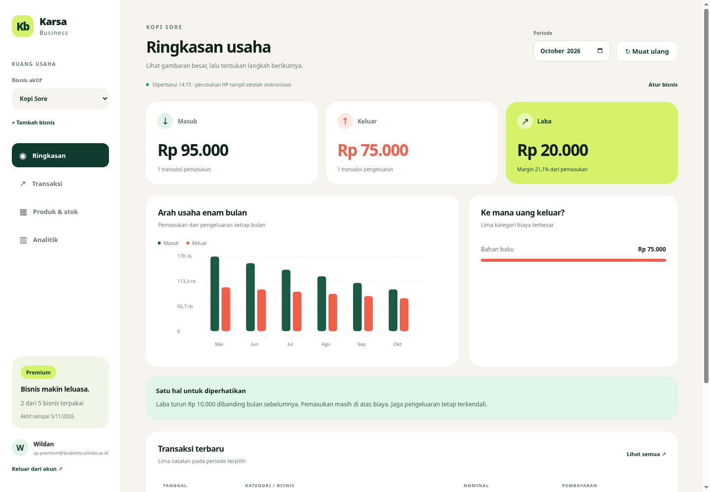

# Karsa Business Premium: HP dan dashboard Vercel

Implementasi awal ini mendukung Gratis (1 bisnis aktif), Premium (maksimal 5 bisnis), dan dashboard web khusus Premium. Status Premium diaktifkan manual oleh pengelola; pembayaran otomatis belum diintegrasikan.



Gambar memakai akun dan transaksi uji, bukan data pengguna produksi.

## Yang sudah tersedia

- Login Google atau email/kata sandi dengan project Firebase yang sama seperti HP. Pembatasan email mahasiswa Untidar dan verifikasi email tetap berlaku.
- Pilih bisnis di HP dan web; transaksi, produk, stok, modal, serta laporan terpisah per bisnis.
- Tambah bisnis (maksimal 5 untuk Premium); bisnis tambahan dibuat online agar batas diperiksa server, termasuk pada permintaan bersamaan.
- Dashboard: ringkasan seluruh bisnis/per bisnis, pencatatan dan edit/hapus transaksi, katalog dan edit/hapus produk, perubahan stok dari penjualan, periode bulanan, tren 6 bulan, kategori biaya, produk terlaris, ekspor CSV, dan cetak laporan melalui menu browser **Save as PDF**.
- Sinkronisasi HP ↔ cloud ↔ web. Web mengambil data terbaru saat dibuka, saat Muat ulang, dan setiap 60 detik ketika tab terlihat dan formulir tidak terbuka. HP tetap dapat mencatat offline pada bisnis aktif yang diizinkan.
- Saat Premium habis, web terkunci dan bisnis tambahan tetap tersimpan/dapat dibaca di HP. Pengguna dapat memilih satu bisnis gratis aktif melalui menu bisnis di HP. Perubahan pending bisnis lain ditahan sampai bisnis tersebut aktif atau Premium diperpanjang.

## Langkah manual: lakukan dalam urutan ini

### 1. Perbarui backend lama dan migrasi database

Untuk pengguna yang APK lamanya masih memakai Neon Function, buka **GitHub → Actions → Deploy Neon Backend → Run workflow → main**. Pastikan secrets `DATABASE_URL`, `NEON_API_KEY`, `NEON_PROJECT_ID`, dan `FIREBASE_PROJECT_ID` benar. Jika memakai `NEON_BRANCH`, pilih branch database yang sama dengan produksi.

Workflow ini menerapkan migration `003_premium_businesses.sql` dan memperbarui endpoint Neon lama. Jangan hanya menghapus constraint satu bisnis pada database sementara function lama belum diperbarui: query function lama masih memakai `ON CONFLICT(owner_id)`. Selama transisi, perubahan yang belum berhasil sinkron tetap tersimpan lokal dan perlu dicoba ulang setelah deployment selesai.

Migrasi mempertahankan semua ID/data lama. Field `legacy_business_id` membuat APK lama tetap mengakses bisnis asli; `free_business_id` menetapkan bisnis gratis aktif. API v1 hanya mengembalikan data bisnis asli sehingga APK lama tidak menarik atau mencampur bisnis tambahan.

Jika ini instalasi baru tanpa APK/Neon Function lama, jalankan file SQL `001_initial.sql`, `002_products.sql`, dan `003_premium_businesses.sql` berurutan melalui Neon SQL Editor sebelum memakai Vercel. Script migration terkelola dapat mengenali/mencatatnya ketika nanti dijalankan; file SQL memakai operasi yang aman diulang. Jangan mengedit migration lama yang sudah masuk ledger checksum.

### 2. Siapkan Firebase untuk web

Pada Firebase project yang sama dengan aplikasi Android:

1. Tambahkan aplikasi **Web** pada Project settings, lalu ambil Web API key dan authDomain dari konfigurasi Firebase web.
2. Pastikan provider **Email/Password** dan **Google** aktif.
3. Tambahkan domain Vercel/domain custom dashboard ke **Authentication → Settings → Authorized domains**. Tambahkan domain preview jika dipakai untuk login.
4. Jika Web API key dibatasi dengan HTTP referrers, izinkan domain dashboard. Gunakan key web; key Android dengan pembatasan package/signing tidak cocok untuk browser.

Dashboard memuat Firebase Auth dari CDN resmi Google. Tidak ada pemasangan paket frontend, dan token sesi dikelola Firebase dengan session persistence. Database credentials tidak pernah dikirim ke browser.

Referensi: [Firebase Google Sign-In](https://firebase.google.com/docs/auth/web/google-signin), [Firebase via CDN](https://firebase.google.com/docs/web/alt-setup).

### 3. Deploy ke Vercel

Import repository **ywildan/karsa-business**:

| Pengaturan | Nilai |
|---|---|
| Production branch | `main` |
| Root Directory | `backend` |
| Framework Preset | `Other` |
| Node.js | `24.x` |
| Build Command | `npm run check` (sudah di vercel.json) |
| Output Directory | `public` (sudah di vercel.json) |

Tambahkan environment variables di Vercel:

| Variable | Nilai |
|---|---|
| `DATABASE_URL` | Pooled PostgreSQL URL Neon, **database/branch yang sama** dengan backend lama |
| `FIREBASE_PROJECT_ID` | Firebase project yang dipakai HP |
| `FIREBASE_WEB_API_KEY` | API key Firebase untuk web |
| `FIREBASE_AUTH_DOMAIN` | Contoh `project-id.firebaseapp.com`; boleh kosong untuk memakai default tersebut |

Set variables untuk Production; gunakan branch database uji terpisah jika mengaktifkan Preview. Deploy/redeploy setelah environment variables tersedia. Vercel memakai dependency backend yang sudah tercatat pada package-lock; implementasi ini tidak menambahkan paket dependency. Tidak perlu menjalankan install apa pun di laptop.

Buka `https://DOMAIN/health`: harus mengembalikan `status: ok`. Ini memeriksa service; login dan pemuatan dashboard juga perlu diuji untuk memastikan database/config berfungsi. `/web-config` hanya menampilkan Firebase identifiers publik. Frontend dan API `/v1/*` serta `/v2/*` berada pada origin yang sama.

Referensi: [Vercel Node.js Functions](https://vercel.com/docs/functions/runtimes/node-js), [vercel.json](https://vercel.com/docs/project-configuration/vercel-json).

### 4. Aktifkan akun Premium secara manual

Login dahulu dari HP lalu sinkronkan, atau login pada dashboard sampai halaman Premium tampil. Dengan begitu akun tercatat dalam `app_users`.

Di **Neon SQL Editor**, ganti email contoh berikut dengan email pengguna. Query ini menambah 30 hari dari akhir masa aktif (atau dari sekarang jika belum aktif):

```sql
UPDATE app_users
SET premium_until = GREATEST(COALESCE(premium_until, now()), now()) + INTERVAL '30 days',
    updated_at = now()
WHERE lower(email) = lower('nama@students.untidar.ac.id')
RETURNING firebase_uid, email, premium_until;
```

Harus ada tepat satu baris hasil. Jika tidak ada, periksa email dan pastikan pengguna sudah login/sinkron ke database yang sama. Tombol **Periksa aktivasi** pada web memuat status terbaru; pada HP tekan **Sinkronkan sekarang**.

Untuk menonaktifkan Premium:

```sql
UPDATE app_users SET premium_until = now(), updated_at = now()
WHERE lower(email) = lower('nama@students.untidar.ac.id')
RETURNING email, premium_until;
```

Tidak ada endpoint pengguna untuk memberi dirinya Premium. Pengelolaan masa aktif dilakukan lewat akses database pengelola.

### 5. Terbitkan APK baru yang menuju Vercel

Di GitHub repository secrets, ubah **`KARSA_API_BASE_URL`** menjadi root origin Vercel, misalnya `https://bisnis.domainmu.id`, **tanpa `/api` atau `/v2`**.

Jalankan **Actions → Android Release → Run workflow → main → centang publish_release**. Setelah berhasil, unduh APK baru dari Releases dan pasang sebagai update, tanpa uninstall. Keystore, package ID, dan Firebase project tetap sama.

Menu nama bisnis di bagian atas HP membuka pemilih bisnis dan tombol **Buka dashboard web**. Tombol tersebut membuka root `KARSA_API_BASE_URL`, sehingga APK baru harus memakai origin Vercel yang memiliki dashboard.

## Checklist setelah deploy

1. Akun Gratis ditolak dari dashboard; pencatatan bisnis pertamanya di HP tetap berfungsi.
2. Akun Premium bisa membuat sampai 5 bisnis; bisnis keenam ditolak.
3. Buat transaksi pada bisnis A dan produk pada bisnis B; data tidak muncul pada bisnis lain.
4. Catat dari HP secara offline, sambungkan lalu sinkronkan; lihat hasilnya di web.
5. Catat penjualan produk di web; stok berkurang. Sinkronkan HP dan periksa stok/transaksi. Hapus penjualan; stok kembali sekali saja.
6. Edit data yang sama dari dua perangkat. Web harus menolak penyimpanan dengan versi lama dan meminta Muat ulang.
7. Nonaktifkan Premium pada akun uji; web terkunci, bisnis tambahan tetap terbaca di HP, dan satu bisnis dapat dijadikan bisnis gratis aktif.
8. Uji login Google sebenarnya di domain produksi, update APK tanpa kehilangan data, dan Back dari layar pengelolaan bisnis/formulir.

## Validasi pengembangan

Pengembangan tidak menjalankan npm/pip/Gradle dependency install atau download lokal: memakai tool/dependency yang sudah tersedia, Gradle offline, browser Chromium yang sudah tersedia, dan image PostgreSQL lokal yang sudah ada dengan `--pull=never` untuk pengujian database sementara.

- Backend TypeScript dan kontrak PostgreSQL: `npm run check` dan `npm test` jika dependency sudah tersedia. `TEST_DATABASE_URL` harus menunjuk database uji terpisah.
- Unit test Android mencakup isolasi dua bisnis, urutan produk sebelum penjualan, pembagian batch per bisnis, dan penahanan perubahan saat Premium habis.
- Browser smoke menggunakan `tests/preview-server.ts` (schema database sementara dan Firebase fixture, **tidak masuk production API**) serta Chromium yang sudah tersedia, lalu `npm run test:browser`. Login Firebase produksi dan pemasangan APK pada HP tetap perlu diuji manual setelah deployment.
- CSV menetralkan formula spreadsheet dari teks pengguna. PDF memakai dialog cetak browser; tidak ada library PDF tambahan.

Konflik perubahan offline tetap mengikuti `updatedAt` terbaru seperti sinkronisasi sebelumnya. Kolaborasi staf/role, pembayaran otomatis, penghapusan bisnis, dan rekonsiliasi konflik stok dua HP yang bersamaan belum ditambahkan.
