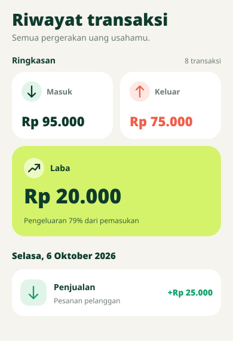

# Ringkasan Riwayat Transaksi

Masuk dan Keluar memakai dua kartu putih dengan panah di lingkaran pastel, sehingga menyatu dengan daftar transaksi dan mudah dibedakan lewat arah ikon serta warna hijau/coral. Laba mendapat kartu lime selebar layar dengan nominal 34sp, sedangkan nominal Masuk/Keluar 22sp dan label 13–14sp, agar angka terpenting langsung terlihat. Radius 22dp dan latar krem mempertahankan gaya ramah aplikasi; pada layar sempit atau teks besar, kartu Masuk/Keluar tersusun vertikal.

Gambar ini adalah ilustrasi dengan nominal contoh, bukan tangkapan layar perangkat. Compose Preview di `HistoryScreen.kt` memakai Rp 95.000 / Rp 75.000 / Rp 20.000; aplikasi tetap menghitung angka dari transaksi yang sesuai pencarian dan filter. Laba negatif memakai latar blush dan ikon tren turun.
